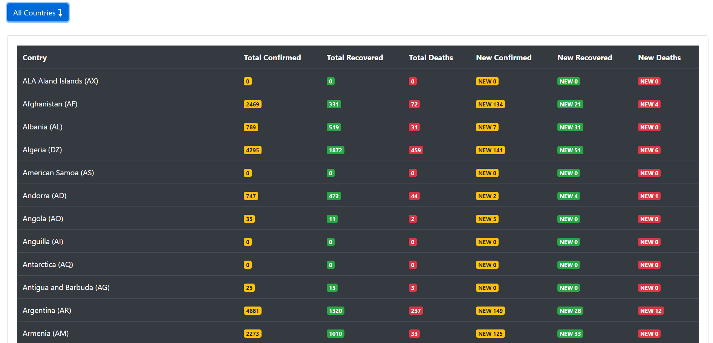
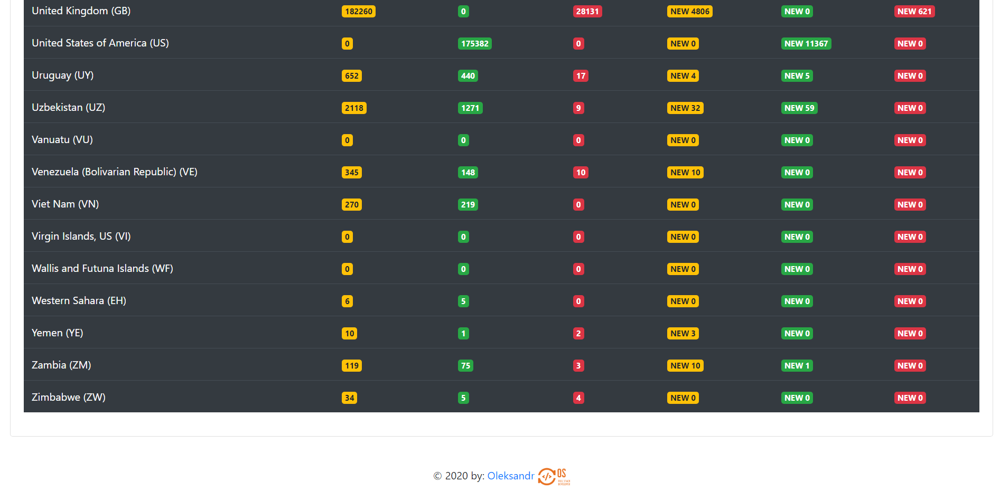

# JS-COVID-19-Tracker
Simple JS COVID-19 Tracker
> __API:__ provided by [Postman](https://documenter.getpostman.com/view/10808728/SzS8rjbc?version=latest "Coronavirus COVID19 API").
***

***

***

***

